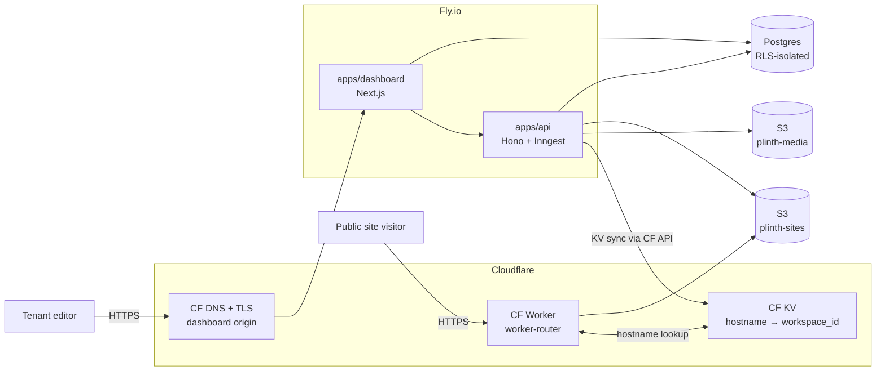
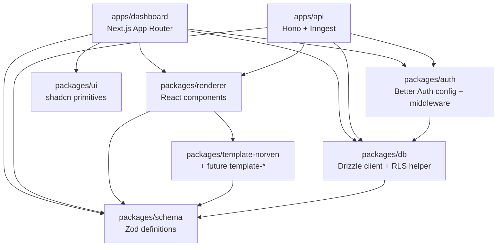
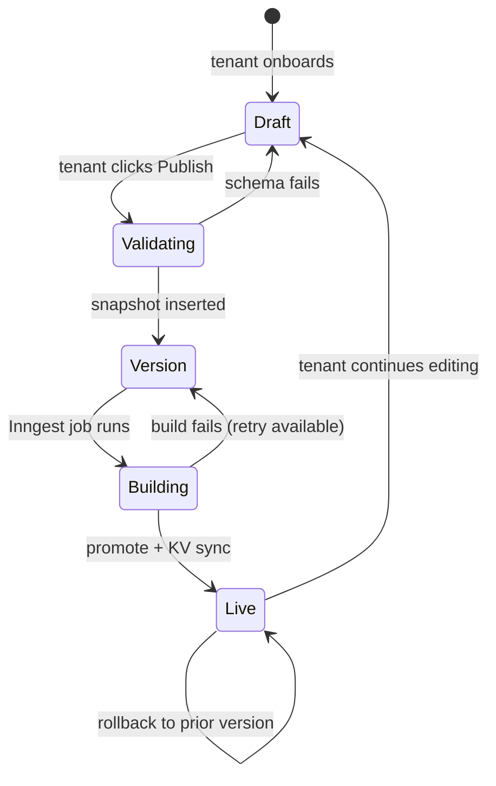
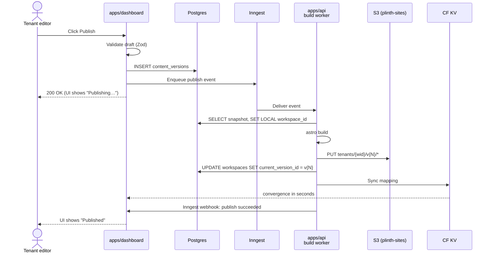
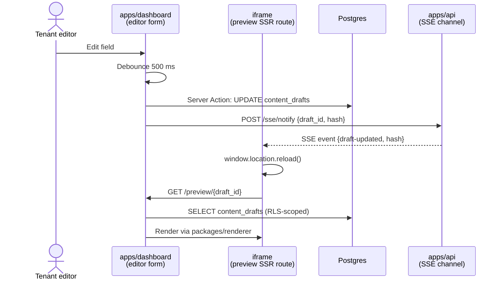

# Architecture

I keep this as a one-screen overview of how Plinth is shaped: the render and runtime model, the module layering across the monorepo, the content state machine, the publish and preview lifecycles, the image pipeline, and the build/deploy boundary. ADRs in `docs/adr/` explain why I made each load-bearing choice; `CONTEXT.md` fixes the vocabulary. Read those for depth; read this for orientation.

## Render and runtime model

Plinth runs as two deployable apps over one Postgres database, fronted by Cloudflare for both the dashboard and the per-tenant sites. The dashboard (Next.js 15 App Router) handles UI, auth, and light CRUD via Server Actions; the api (Hono) handles uploads, SSE preview channels, webhooks, and background jobs through Inngest. Tenant sites are statically built per publish — the renderer is `astro build` against an immutable content snapshot, output goes to S3, and a Cloudflare Worker routes by hostname into the correct per-tenant version path.

The deploy boundary for tenant sites is `s3://plinth-sites/tenants/{workspace_id}/v{N}/`. Everything to the left is the platform; everything to the right is what a public visitor fetches. See [ADR-0008](./docs/adr/0008-repo-and-runtime-topology.md) for the runtime split and [ADR-0003](./docs/adr/0003-publish-pipeline.md) for the publish pipeline.

## Module layering

Two apps plus six shared packages, with dependencies flowing one direction. Apps depend on packages; packages depend on each other in one direction; nothing else.

Each app is the only place HTTP and view code lives. Domain logic — anything that knows about workspaces, drafts, versions, media, or hostnames — lives in `apps/dashboard/server/services/` (dashboard) or `apps/api/modules/*/service.ts` (api), per [ADR-0009](./docs/adr/0009-backend-architecture.md). Shared packages never import from apps; the lint rule fails any reverse import.

## Content state machine

A workspace's content moves through three states, mediated by Publish.

- **Draft** is one mutable row per workspace in `content_drafts`.
- **Version** is an immutable row per publish click in `content_versions`. Each version owns one S3 prefix.
- **Live** is the version pointed to by `workspaces.current_version_id`, which the Cloudflare Worker reads through KV.

Per [ADR-0002](./docs/adr/0002-tenant-isolation.md), every row carries `workspace_id`; RLS denies any cross-tenant read.

## Publish lifecycle

Failure modes are bounded. A schema validation failure stops the flow before any version is inserted. A build failure leaves the previous `current_version_id` intact; the tenant sees an error and a Retry button. Inngest's automatic retries cover transient failures invisibly. See [ADR-0003](./docs/adr/0003-publish-pipeline.md) for retry policy, idempotency, and DLQ posture.

## Preview lifecycle

The preview is the production renderer rendering the draft. The dashboard mounts an iframe at `/preview/[draft_id]` — a Next App Router SSR route that imports `packages/renderer` and renders against the draft row. When the editor saves, the api emits an SSE event; the iframe reloads.

Per [ADR-0007](./docs/adr/0007-preview-architecture.md), the same renderer module produces preview and production output; drift is structurally impossible because both paths share `packages/renderer`. Reload-on-update beats DOM patching because patching forces the renderer to expose patch boundaries it does not need.

## Image pipeline

Image processing happens at upload, not at publish ([ADR-0006](./docs/adr/0006-media-pipeline.md)). The dashboard POSTs to the api; the api validates, computes a SHA-256, deduplicates against `(workspace_id, content_hash)`, and on miss runs Sharp to emit AVIF + WebP + JPEG variants at `[400, 800, 1200, 1600]` widths. Variants land in `s3://plinth-media/tenants/{workspace_id}/{content_hash}/w{width}.{format}` and a `media` row is inserted. The publish-time Astro build references the already-processed CDN URLs; Sharp does not run again.

Cloudflare CDN serves variants directly from S3. The same URL works in preview and production — the `resolveImageUrl()` helper is a kept seam for future signed-URL gating but currently resolves identically in both modes.

## Build and deploy boundary

`pnpm verify` is the local gate — format, lint, typecheck, test, build for every affected app. CI runs the same `pnpm verify` filtered through Turborepo's affected graph, plus dependency review, CodeQL, axe a11y, and Lighthouse budgets on the dashboard preview route. The cross-tenant RLS probe test is in the gate; a regression there ship-blocks.

Deploy is two-stage. The dashboard and api each have a Dockerfile and a Fly.io app; CI authenticates via OIDC scoped deploy tokens and pushes container images to Fly's registry. Tenant sites are independent — every publish writes to `s3://plinth-sites/tenants/{workspace_id}/v{N}/` directly from the build worker, bypassing the dashboard's deploy cycle entirely. A dashboard deploy never affects live tenant sites; a tenant publish never affects the dashboard.

Edge response headers for the dashboard (CSP, HSTS, Permissions-Policy, COOP, CORP) and for the per-tenant sites are applied as Cloudflare Transform Rules, matching Norven's posture from `norven/docs/security-headers.md`.

## Intentionally not here

- **No SSR for tenant sites.** Tenants get statically built HTML. If a tenant route ever needs request-time data (e.g., a contact form posting to the tenant's own endpoint), it lives in a Cloudflare Worker, not in the renderer.
- **No edge rendering.** The Cloudflare Worker routes; it does not render. Rebuild-on-edit is the cost of static; instant deploy propagation is the win.
- **No visual canvas editor.** The editor is field-based per [ADR-0001](./docs/adr/0001-editor-model.md). Free placement is out of scope.
- **No rich-text by default.** A long-prose section type may add a constrained Tiptap renderer when the first tenant needs it.
- **No analytics or error tracking in MVP.** Honeycomb covers tracing; per-tenant analytics is deferred to a Plausible/Umami integration when there's tenant demand.
- **No microservices per domain.** One api process owns every domain. Splitting comes when a single domain's workload demands it, not by default.
- **No DDD aggregates, hexagonal ports, or DI containers.** Module-per-domain with three layering rules suffices per [ADR-0009](./docs/adr/0009-backend-architecture.md).

This shape is the point. One repo to clone, two runtimes to deploy, ten ADRs of reasoning. The discipline it lets me hold — one toolchain, one place to look — is the engineering bet behind Plinth.
